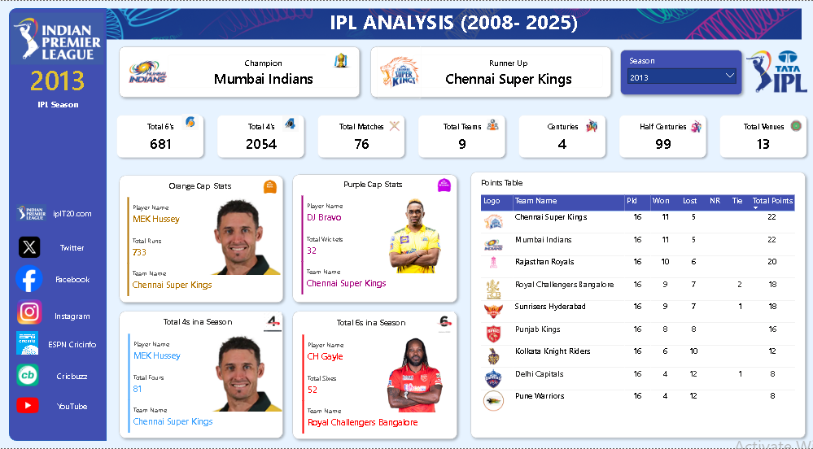
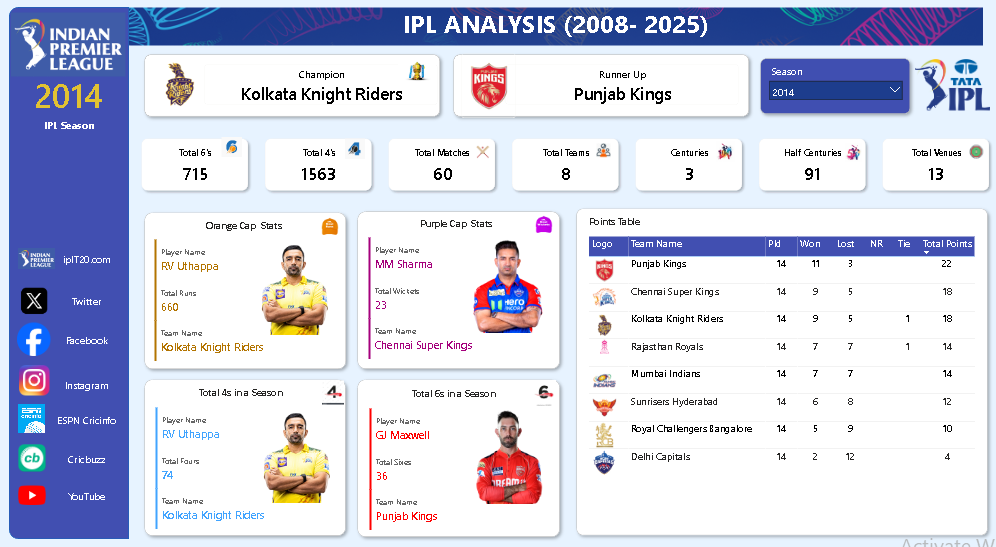
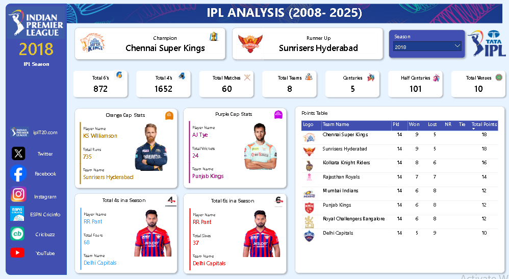
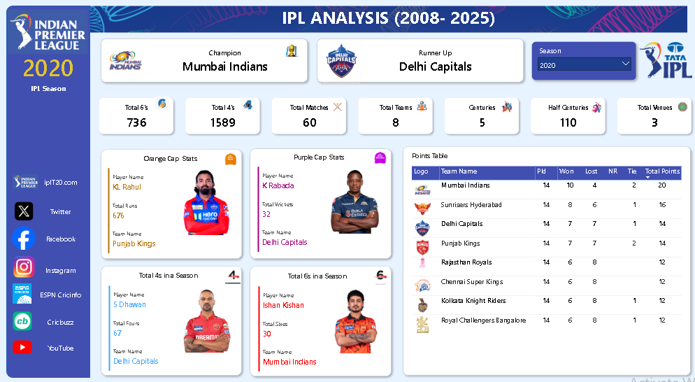
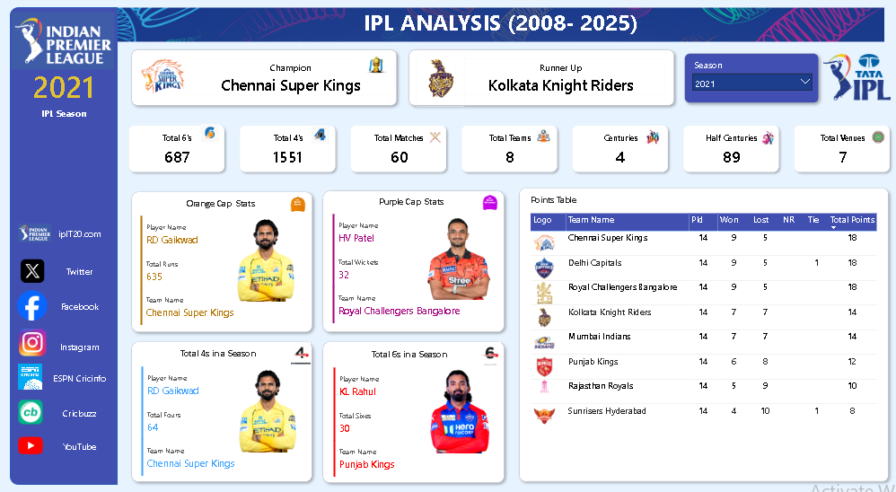
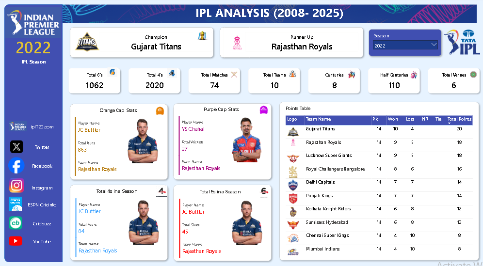
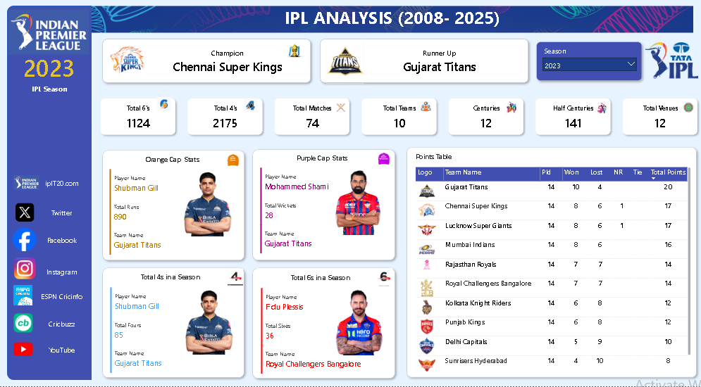

# 🏏 IPL Analytics Dashboard (2008–2025)

## Project Overview

This Power BI IPL Analytics Dashboard provides comprehensive insights into Indian Premier League seasons from 2008 to 2025. The dashboard enables season-wise analysis of champions, runners-up, points tables, batting records, bowling records, team performance, and player achievements. Interactive filters allow users to explore trends and compare statistics across different IPL seasons.

---

## Project Objective

To analyze IPL seasons from 2008–2025 and provide interactive insights into team performance, player achievements, championship history, and season-wise trends using Power BI.

---

## Key Features

- Season-wise IPL Analysis (2008–2025)
- Champion and Runner-Up Tracking
- Points Table Analysis
- Orange Cap Statistics
- Purple Cap Statistics
- Total Matches Analysis
- Team Performance Comparison
- Total Fours and Sixes Analysis
- Centuries and Half-Centuries Tracking
- Venue Analysis
- Interactive Filters and Slicers

---

## Tools Used

- Power BI
- Power Query
- DAX
- Excel

---

## Dashboard Preview

### Season Dashboard

---

## Files Included

- IPL_Analysis_Dashboard.pbix
- IPL_Analytics_Dashboard.mp4
- Dashboard Screenshots

---

## Skills Demonstrated

- Data Cleaning
- Data Modeling
- DAX Calculations
- Sports Analytics
- KPI Reporting
- Dashboard Design
- Data Visualization
- Interactive Reporting

---

## Business Insights

- Mumbai Indians established themselves as one of the most successful IPL teams, securing multiple championship victories across seasons.
- Chennai Super Kings (CSK) and Kolkata Knight Riders (KKR) have been among the most dominant IPL franchises, consistently qualifying for playoffs and winning multiple championships.
- The 2025 season saw Royal Challengers Bangalore (RCB) win their maiden IPL championship, while Punjab Kings finished as runners-up.
- Total sixes and half-centuries increased significantly in recent seasons, reflecting the evolution of aggressive T20 batting strategies.
- Gujarat Titans produced standout individual performances in 2025, with Sai Sudharsan winning the Orange Cap and Prasidh Krishna claiming the Purple Cap.
- The expansion from 8 to 10 teams increased competition, match volume, and opportunities for emerging talent.
- Season-wise analysis enables comparison of champions, top performers, points tables, and batting/bowling trends from 2008–2025.

---

## Future Enhancements

- Player vs Player comparison
- Team performance trend analysis
- Venue-wise performance insights
- Head-to-head team comparison
- Advanced batting and bowling metrics

---

## Conclusion

This dashboard demonstrates how Power BI can be used to analyze sports data and uncover meaningful insights from historical IPL seasons. By combining interactive visualizations, KPI tracking, and season-wise comparisons, the dashboard provides an engaging platform for exploring team and player performance across the IPL era.
